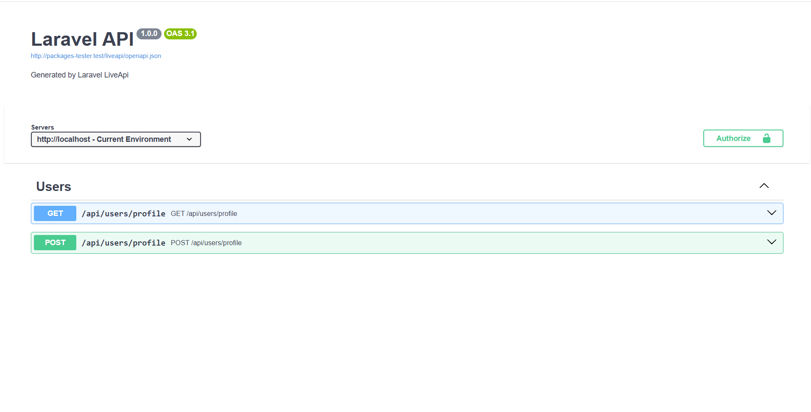

# Laravel LiveApi

Accurate OpenAPI 3.1 generation by observing real API traffic at runtime.  
Zero annotations. Minimal configuration. Hard-disabled in production.

---

## What is Laravel LiveApi?

Laravel LiveApi generates an OpenAPI specification by **observing real requests and real responses** while you use your API during development or testing.

You do not describe your API.  
You do not annotate your code.  
You simply **use your API**, and documentation is produced as a side effect.

If the API runs, LiveApi can document it.

---

## Installation

Install the package as a development dependency:

```bash
composer require zidbih/laravel-liveapi --dev
```

Publish the configuration file (recommended):

```bash
php artisan vendor:publish --tag=liveapi-config
```

No further setup is required.

---

## Zero configuration workflow

1. Make requests to your API using:
   - Postman
   - Swagger UI
   - Browser
   - Automated tests

2. LiveApi observes:
   - request headers
   - query parameters
   - request body
   - response status codes
   - response JSON structure

3. Generate the OpenAPI specification:

```bash
php artisan liveapi:generate
```

You now have a deterministic `openapi.json` file that reflects what your API actually does.

---

## Dashboard

Laravel LiveApi exposes a local dashboard at `/liveapi` that renders the generated OpenAPI specification, with the raw spec available at `/liveapi/openapi.json`. The dashboard is enabled only in local and testing environments and uses Swagger UI by default as a viewer. It requires no configuration and reflects the API’s actual runtime behavior inferred from real requests and responses. The dashboard is intentionally thin — the generated `openapi.json` file remains the primary output and can be consumed by any OpenAPI-compatible tool.

> Example of the Swagger UI dashboard rendering an OpenAPI specification inferred from real API traffic during local development.



---

## Environment configuration (optional)

Laravel LiveApi works out of the box with **zero configuration**.  
You do **not** need to define any environment variables to start using it.

The variables below are **optional** and can be used only if you want to **override the default behavior or metadata**.

```env
# Enable or disable LiveApi entirely (ignored in production)
LIVEAPI_ENABLED=true

# Freeze schema evolution (read-only mode)
LIVEAPI_FROZEN=false

# Customize OpenAPI metadata
LIVEAPI_TITLE="My Application API"
LIVEAPI_DESCRIPTION="Generated by Laravel LiveApi"
LIVEAPI_VERSION="0.1.0"

# Base URL used in the OpenAPI servers section
LIVEAPI_BASE_URL=http://localhost

```

## How it works

- A global middleware intercepts all `api/*` routes
- Each request/response pair becomes a snapshot
- Multiple snapshots for the same route are merged
- The schema is inferred deterministically:
  - field types
  - required vs optional fields
  - nullable fields
  - multiple response variants
- Authentication context is tracked separately

The running API is the source of truth.

---

## Example

### Route definition

```php
Route::get('/api/users/profile', function (Request $request) {
    $data = [
        'id' => 1,
        'username' => 'zidbih',
    ];

    if ($request->has('extra')) {
        $data['bio'] = 'Software Engineer';
    }

    return response()->json($data);
});
```

### Observed behavior

- Request without `extra`:
```json
{ "id": 1, "username": "zidbih" }
```

- Request with `?extra=1`:
```json
{ "id": 1, "username": "zidbih", "bio": "Software Engineer" }
```

### Generated schema (simplified)

```json
{
  "type": "object",
  "properties": {
    "id": { "type": "integer" },
    "username": { "type": "string" },
    "bio": { "type": "string" }
  },
  "required": ["id", "username"]
}
```

Optional fields are inferred automatically.

---

## Commands

### Generate OpenAPI specification

```bash
php artisan liveapi:generate
```

Compiles all captured snapshots into a single `openapi.json` file.

---

### Show status

```bash
php artisan liveapi:status
```

Displays:
- current environment
- enabled / frozen state
- number of captured routes
- snapshot count
- whether `openapi.json` exists

---

### Clear snapshots

```bash
php artisan liveapi:clear
```

Delete all recorded snapshots.

Delete snapshots and the generated spec:

```bash
php artisan liveapi:clear --spec
```

---

## Freeze mode

Once your API contract is stable, you can freeze schema evolution:

```env
LIVEAPI_FROZEN=true
```

When frozen:
- no new snapshots are recorded
- existing schemas are not modified
- the dashboard remains accessible
- `liveapi:generate` continues to work

Freeze mode turns LiveApi into a read-only documentation system.

---

## Production safety

Laravel LiveApi is hard-disabled in production.

- no middleware capture
- no snapshot writes
- no override flag

This guarantee is enforced at multiple layers.

---

## Storage model

All data is stored as plain JSON:

```
storage/liveapi/
├── snapshots/
│   ├── get-api-users-profile.json
│   ├── post-api-users-profile.json
│   └── ...
└── openapi.json
```

The files are human-readable, diffable, and git-friendly.

---

## Using the generated OpenAPI file

The generated `openapi.json` can be consumed by:

- Swagger UI
- Postman
- Redoc
- Stoplight
- Client SDK generators
- API gateways
- Contract testing tools

Laravel LiveApi does not lock you into any viewer.

---

## Testing and quality

- Fully tested with Pest
- Uses Orchestra Testbench
- Freeze and production guarantees are covered
- Tests assert behavior, not internals

---

## When should you use this?

Laravel LiveApi is useful when:
- APIs evolve frequently
- documentation drift is a problem
- client SDKs rely on OpenAPI
- accuracy matters more than annotations

It does not replace Postman or Swagger.  
It makes their usage produce accurate documentation automatically.

---

## License

MIT License.

---

## Philosophy

Documentation should be observed, not declared.

Laravel LiveApi exists to keep API documentation accurate, boring, and trustworthy.
